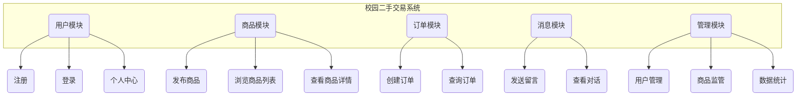

### **一、需求分析**

#### **(1) 问题描述**

​	随着高校学生对资源循环利用意识的增强以及消费观念的转变，校园内的二手物品交易需求日益旺盛。然而，传统的线下交易或基于社交群组的交易方式存在信息不对称、效率低下、管理不便等诸多问题。

​	本系统旨在设计并实现一个专门面向校园用户的二手交易平台。该平台参考了“闲鱼”、“转转”等成熟的二手交易网站，致力于为在校学生提供一个安全、便捷、高效的线上二手物品信息发布与交易撮合环境。系统通过Web网页端呈现，用户可以方便地进行注册登录、发布闲置物品、浏览和购买商品、与交易方进行沟通，同时平台管理员能够对系统进行有效监管。

#### **(2) 系统功能描述**

本系统主要分为两大角色：普通用户（兼具买家和卖家身份）和管理员。

**1. 普通用户功能模块**

普通用户是系统的核心使用者，其功能涵盖了完整的交易生命周期。

*   **注册与登录**：用户通过学号、用户名等信息进行注册，并通过登录进入系统。这是使用所有功能的前提。
    *   **操作流程图**:
        ```mermaid
        graph TD
            A[访问首页] --> B{是否已注册?};
            B -- 是 --> C[输入用户名/密码];
            B -- 否 --> D[进入注册页面];
            D --> E[输入用户名/密码/学号/性别];
            E --> F{信息校验};
            F -- 成功 --> G[提示注册成功，跳转至登录页];
            F -- 失败 --> H[提示错误信息];
            C --> I{登录验证};
            I -- 成功 --> J[进入商品主页];
            I -- 失败 --> K[提示错误信息];
        ```
*   **商品管理**：用户可以发布自己的闲置物品，并查看自己发布过的所有商品。
    *   **发布商品**：输入商品名称、分类、价格、描述和图片链接来上架一个新商品。
    *   **查看我发布的**：在个人中心查看自己所有上架的商品，包括其当前状态（在售、已售、已下架），并可按多种条件进行复杂查询。
*   **交易功能**：用户可以浏览、搜索、购买和咨询商品。
    *   **浏览商品**：在主页查看所有在售商品列表。
    *   **商品详情**：点击商品进入详情页，查看详细信息。
    *   **购买商品**：在详情页点击购买，生成订单。本系统为模拟线下交易，不涉及真实支付流程。
    *   **查看我买到的**：在个人中心查看自己的所有购买订单记录，并可按多种条件进行复杂查询。
*   **沟通功能**：
    *   **留言咨询**：在商品详情页向卖家发起留言咨询。
    *   **消息中心**：查看与自己相关的所有对话列表，并可与对方进行实时沟通。

**2. 管理员功能模块**

管理员负责系统的后台维护与数据监控。

*   **后台登录**：通过固定的管理员账号密码登录后台管理界面。
*   **用户管理**：查看所有注册用户信息，并可根据用户名或学号进行精确查询。
*   **商品管理**：强制删除违规商品，维护平台环境。
*   **数据汇总**：
    *   **挂牌信息汇总**：按多种条件（关键词、分类、价格、时间）统计平台所有商品的挂牌情况（总数、在售数、已售数），以报表形式呈现。
    *   **成交情况汇总**：按多种条件统计平台的成交情况（成交笔数、成交总额），以报表形式呈现。
    *   **操作流程图 (以成交情况汇总为例)**:
        ```mermaid
        graph TD
            A[管理员登录] --> B[进入后台管理面板];
            B --> C[选择“汇总统计”标签];
            C --> D[输入查询条件];
            D --> E[点击“查询”按钮];
            E --> F{后端处理};
            F --> G[前端以报表形式展示成交情况];
        ```

**所需存储的数据信息分析**

根据上述功能，系统需要存储以下核心数据：

*   **用户数据**：ID、用户名、加密后的密码、性别、学号、余额（模拟）、注册时间。
*   **商品数据**：ID、卖家ID、商品名称、描述、分类、价格、图片链接、状态（在售/已售/已下架）、发布时间。
*   **订单数据**：ID、商品ID、买家ID、卖家ID、成交价格、订单创建时间。
*   **消息数据**：ID、关联的商品ID、发送者ID、接收者ID、消息内容、发送时间。

#### **(3) 数据库完整性方面的要求**

为保证数据的准确性、一致性和可靠性，本系统在数据库层面设计了多重完整性约束。

1.  **原子性事务 (Atomicity)**：
    *   **用户购买商品**的操作是一个典型的原子性事务。它包含两个步骤：1）更新商品表（`products`）的状态为“已售”；2）在订单表（`orders`）中插入一条新的订单记录。这两个操作必须同时成功或同时失败。如果更新了商品状态但订单未生成，会导致数据不一致。因此，我们定义了一个名为 `sp_purchase_product` 的**存储过程**来封装此事务，利用 `START TRANSACTION`, `COMMIT`, `ROLLBACK` 和 `EXIT HANDLER` 确保其原子性。

2.  **存储过程 (Stored Procedure)**：
    *   **购买事务处理 (`sp_purchase_product`)**：如上所述，保证购买操作的原子性。
    *   **复杂报表查询 (`sp_get_my_products`, `sp_get_products_summary`, `sp_get_sales_summary`, `sp_get_users`)**：将个人中心和管理员后台的复杂、多条件、可选参数的查询逻辑封装在存储过程中。这样做可以简化应用层代码，提高执行效率，并便于逻辑复用和维护。

3.  **触发器 (Trigger)**：
    *   **防止用户购买自己的商品 (`trg_prevent_self_purchase`)**：定义一个在向订单表（`orders`）插入数据**之前**（`BEFORE INSERT`）触发的触发器。该触发器检查待插入订单的 `buyer_id` 和 `seller_id` 是否相同。若相同，则主动抛出异常，阻止该笔订单的生成，从而在数据库层面强制执行此核心业务规则。

4.  **用户权限 (Privileges)**：
    *   **普通用户**：只能对自己的信息、发布的商品进行修改，只能创建订单和消息，只能查询与自己相关的订单和消息。其所有数据库操作均通过后端API间接执行，无法直接访问数据库。
    *   **管理员**：拥有更高的权限，可以查询所有用户信息、删除任意商品、查看全局统计数据。同样，其操作也通过受保护的后端API执行。
    *   **数据库账户**：在生产环境中，应为Web应用创建一个专用的数据库用户，并仅授予其对 `campus_trade_db` 数据库执行`SELECT`, `INSERT`, `UPDATE`, `DELETE`, `EXECUTE` (执行存储过程) 的权限，禁止其执行`DROP`, `CREATE TABLE`等高风险操作，以增强数据库安全性。

#### **(4) 社会、安全、法律等因素及数据库安全性设置**

1.  **社会因素**：
    *   **诚信体系**：本系统基于校园环境，具有天然的熟人社交属性，有助于建立较高的诚信基础。但仍需考虑未来引入用户信誉评级、交易评价等功能，以鼓励诚信交易，惩戒不良行为。
    *   **资源循环**：系统倡导绿色、环保的消费理念，有助于在校园内推广资源循环利用的文化，具有积极的社会意义。

2.  **法律与合规因素**：
    *   **用户隐私**：系统收集用户的学号等个人信息，必须严格遵守《中华人民共和国个人信息保护法》。学号等敏感信息在设计上已明确要求除用户本人和管理员外不可见。
    *   **禁止交易物品**：平台需明确规定禁止交易的物品清单（如管制刀具、非法出版物等），并由管理员进行监管，以符合相关法律法规。
    *   **知识产权**：用户发布的商品信息（特别是图片和描述）可能涉及版权问题，平台应设立侵权投诉渠道。

3.  **数据库安全性的设置**：
    *   **密码加密存储**：严格禁止在数据库中明文存储用户密码。本系统采用**凯撒加密**算法对密码进行加密后存储。尽管此加密方式简单，仅为满足课程设计要求，但在真实环境中必须替换为**BCrypt**等加盐哈希算法，以有效防止密码数据库泄露后的彩虹表攻击。
    *   **防SQL注入**：本系统后端采用MyBatis框架，其`#{...}`占位符机制使用了预编译语句（`PreparedStatement`），从根本上杜绝了SQL注入的风险。所有用户输入的数据在传递给SQL执行前都经过了参数化处理。
    *   **权限控制**：如前所述，通过后端API对不同角色（普通用户、管理员）的数据库访问权限进行严格控制，确保用户只能访问其被授权的数据。
    *   **数据备份与恢复**：在生产环境中，必须制定定期的数据库备份策略（如每日全量备份、增量备份），并进行恢复演练，以防数据丢失或损坏。
    *   **网络安全**：数据库服务器不应直接暴露在公网上。应将其置于防火墙后，仅允许来自应用服务器的IP地址访问其端口（如3306）。


### **二、概念结构设计**

**系统整体E-R模型：**


本系统的核心实体包括：**用户（User）**、**商品（Product）**、**订单（Order）** 和 **消息（Message）**。它们之间的关系错综复杂，共同构成了校园二手交易的核心业务逻辑。

#### **E-R图模型说明**

##### **1. 实体 (Entities)**

E-R图中定义了四个核心实体，分别对应系统中的主要业务对象：

*   **USER (用户)**: 代表系统中的注册用户，他们既可以是商品的发布者（卖家），也可以是商品的购买者（买家）。
    *   `id (PK)`: 用户的唯一标识符，作为主键。
    *   `username`: 用户登录时使用的名称，具有唯一性。
    *   `password`: 用户密码，经过加密后存储。
    *   `gender`: 用户性别。
    *   `student_id`: 用户的学号，作为校园认证的依据，具有唯一性。
    *   `balance`: 用户的模拟余额，用于展示。
    *   `created_at`: 记录用户注册的时间戳。

*   **PRODUCT (商品)**: 代表用户发布用于交易的闲置物品。
    *   `id (PK)`: 商品的唯一标识符，作为主键。
    *   `name`: 商品的标题或名称。
    *   `description`: 对商品的详细文字描述。
    *   `category`: 商品所属的分类，如“电子产品”、“书籍教材”等。
    *   `price`: 商品的定价。
    *   `image_url`: 指向商品展示图片的URL链接。
    *   `status`: 商品当前的交易状态，如“在售”、“已售”、“已下架”。
    *   `created_at`: 记录商品发布的时间戳。

*   **ORDER (订单)**: 代表一次成功的交易记录，是商品从“在售”状态转变为“已售”状态的结果。
    *   `id (PK)`: 订单的唯一标识符，作为主键。
    *   `order_price`: 订单最终的成交价格，通常与商品价格一致。
    *   `created_at`: 记录订单生成的时间戳。

*   **MESSAGE (消息)**: 代表用户之间围绕某个商品进行的沟通内容。
    *   `id (PK)`: 消息的唯一标识符，作为主键。
    *   `content`: 消息的具体文本内容。
    *   `created_at`: 记录消息发送的时间戳。

##### **2. 关系 (Relationships)**

实体之间的关系通过连接线和基数符号表示，揭示了业务规则：

*   **`USER ||--o{ PRODUCT : "发布"`**
    *   **关系**: 一个用户可以发布零个或多个商品。
    *   **基数**: 1对多 (1:N)。
    *   **实现**: 在`PRODUCT`表中设置一个`seller_id`外键，指向`USER`表的`id`。

*   **`USER ||--o{ ORDER : "购买"`**
    *   **关系**: 一个用户作为买家，可以拥有零个或多个订单。
    *   **基数**: 1对多 (1:N)。
    *   **实现**: 在`ORDER`表中设置一个`buyer_id`外键，指向`USER`表的`id`。

*   **`USER ||--o{ ORDER : "售出"`**
    *   **关系**: 一个用户作为卖家，可以拥有零个或多个售出订单。
    *   **基数**: 1对多 (1:N)。
    *   **实现**: 在`ORDER`表中设置一个`seller_id`外键，指向`USER`表的`id`。

*   **`PRODUCT }o--|| ORDER : "生成"`**
    *   **关系**: 一个商品只能生成一个订单，且必须生成一个订单（一旦交易成功）。
    *   **基数**: 1对1 (1:1)。
    *   **实现**: 在`ORDER`表中设置一个`product_id`外键，指向`PRODUCT`表的`id`，并为该外键添加**唯一约束（UNIQUE）**，确保其1对1的关系。

*   **`USER ||--o{ MESSAGE : "发送"` / `"接收"`**
    *   **关系**: 一个用户可以发送或接收零条或多条消息。
    *   **基数**: 1对多 (1:N)。
    *   **实现**: 在`MESSAGE`表中分别设置`sender_id`和`receiver_id`外键，都指向`USER`表的`id`。

*   **`PRODUCT ||--o{ MESSAGE : "关于"`**
    *   **关系**: 一个商品下可以有零条或多条相关的留言。
    *   **基数**: 1对多 (1:N)。
    *   **实现**: 在`MESSAGE`表中设置一个`product_id`外键，指向`PRODUCT`表的`id`。

### **三、逻辑结构设计**

#### **(1) 模式设计**

根据E-R模型，转换为以下四个关系模式。

**数据字典：**

**1. 用户表 (users)**
| 字段名       | 数据类型  | 长度 | 主键 | 外键 | 可空 | 约束/默认值               | 描述         |
| :----------- | :-------- | :--- | :--- | :--- | :--- | :------------------------ | :----------- |
| `id`         | INT       |      | 是   |      | 否   | AUTO_INCREMENT            | 用户ID       |
| `username`   | VARCHAR   | 50   |      |      | 否   | UNIQUE                    | 用户名       |
| `password`   | VARCHAR   | 255  |      |      | 否   |                           | 加密后的密码 |
| `gender`     | VARCHAR   | 10   |      |      | 否   | CHECK IN ('男', '女')     | 性别         |
| `student_id` | VARCHAR   | 20   |      |      | 否   | UNIQUE                    | 学号         |
| `balance`    | DECIMAL   | 10,2 |      |      | 否   | DEFAULT 10000.00          | 余额         |
| `created_at` | TIMESTAMP |      |      |      | 是   | DEFAULT CURRENT_TIMESTAMP | 注册时间     |

**2. 商品表 (products)**
| 字段名        | 数据类型  | 长度 | 主键 | 外键 | 可空 | 约束/默认值                                         | 描述     |
| :------------ | :-------- | :--- | :--- | :--- | :--- | :-------------------------------------------------- | :------- |
| `id`          | INT       |      | 是   |      | 否   | AUTO_INCREMENT                                      | 商品ID   |
| `seller_id`   | INT       |      |      | 是   | 否   | REFERENCES `users`(`id`)                            | 卖家ID   |
| `name`        | VARCHAR   | 100  |      |      | 否   |                                                     | 商品名称 |
| `description` | TEXT      |      |      |      | 是   |                                                     | 商品描述 |
| `category`    | VARCHAR   | 50   |      |      | 否   |                                                     | 物品种类 |
| `price`       | DECIMAL   | 10,2 |      |      | 否   | CHECK (`price` > 0)                                 | 价格     |
| `image_url`   | VARCHAR   | 255  |      |      | 是   |                                                     | 图片链接 |
| `status`      | VARCHAR   | 20   |      |      | 否   | DEFAULT '在售', CHECK IN ('在售', '已售', '已下架') | 商品状态 |
| `created_at`  | TIMESTAMP |      |      |      | 是   | DEFAULT CURRENT_TIMESTAMP                           | 上架时间 |

**3. 订单表 (orders)**
| 字段名        | 数据类型  | 长度 | 主键 | 外键 | 可空 | 约束/默认值                         | 描述         |
| :------------ | :-------- | :--- | :--- | :--- | :--- | :---------------------------------- | :----------- |
| `id`          | INT       |      | 是   |      | 否   | AUTO_INCREMENT                      | 订单ID       |
| `product_id`  | INT       |      |      | 是   | 否   | UNIQUE, REFERENCES `products`(`id`) | 交易的商品ID |
| `buyer_id`    | INT       |      |      | 是   | 否   | REFERENCES `users`(`id`)            | 买家ID       |
| `seller_id`   | INT       |      |      | 是   | 否   | REFERENCES `users`(`id`)            | 卖家ID       |
| `order_price` | DECIMAL   | 10,2 |      |      | 否   |                                     | 订单成交价格 |
| `created_at`  | TIMESTAMP |      |      |      | 是   | DEFAULT CURRENT_TIMESTAMP           | 订单创建时间 |

**4. 留言表 (messages)**
| 字段名        | 数据类型  | 长度 | 主键 | 外键 | 可空 | 约束/默认值                 | 描述         |
| :------------ | :-------- | :--- | :--- | :--- | :--- | :-------------------------- | :----------- |
| `id`          | INT       |      | 是   |      | 否   | AUTO_INCREMENT              | 留言ID       |
| `product_id`  | INT       |      |      | 是   | 否   | REFERENCES `products`(`id`) | 关联的商品ID |
| `sender_id`   | INT       |      |      | 是   | 否   | REFERENCES `users`(`id`)    | 发送者ID     |
| `receiver_id` | INT       |      |      | 是   | 否   | REFERENCES `users`(`id`)    | 接收者ID     |
| `content`     | TEXT      |      |      |      | 否   |                             | 留言内容     |
| `created_at`  | TIMESTAMP |      |      |      | 是   | DEFAULT CURRENT_TIMESTAMP   | 留言时间     |

#### **(2) 子模式设计**

为了简化“我买到的订单”这一复杂查询，我们定义了一个视图（View）作为子模式。

**视图表：v_orders_details (订单详情视图)**

**数据字典：**
| 字段名             | 数据类型  | 长度 | 主键 | 外键 | 可空 | 描述         |
| :----------------- | :-------- | :--- | :--- | :--- | :--- | :----------- |
| `order_id`         | INT       |      | 否   |      | 否   | 原订单ID     |
| `order_price`      | DECIMAL   | 10,2 |      |      | 否   | 订单成交价格 |
| `created_at`       | TIMESTAMP |      |      |      | 是   | 订单创建时间 |
| `buyer_id`         | INT       |      |      |      | 否   | 买家ID       |
| `seller_id`        | INT       |      |      |      | 否   | 卖家ID       |
| `product_id`       | INT       |      |      |      | 否   | 商品ID       |
| `product_name`     | VARCHAR   | 100  |      |      | 否   | 商品名称     |
| `product_category` | VARCHAR   | 50   |      |      | 否   | 商品分类     |

**说明**：该视图通过内连接（`JOIN`）将`orders`表和`products`表关联起来，将订单信息和其对应的商品信息（名称、分类）整合到一张虚拟表中。应用程序在查询用户购买历史时，可以直接查询此视图，而无需在代码中编写复杂的`JOIN`语句，极大地简化了应用逻辑并提高了可读性。

### **四、数据库的物理设计**

#### **(1) 索引设计**

为了提高查询性能，除了主键和唯一约束自动创建的索引外，我们还应为经常用于查询条件（`WHERE`子句）、连接条件（`JOIN`）和排序（`ORDER BY`）的列手动创建索引。

**已创建的索引分析：**

1.  **`users`表**：
    *   `PRIMARY` (on `id`): 主键索引，由`PRIMARY KEY`自动创建。
    *   `username` (on `username`): 唯一索引，由`UNIQUE`约束自动创建。用于快速检查用户名是否存在及登录验证。
    *   `student_id` (on `student_id`): 唯一索引，由`UNIQUE`约束自动创建。用于快速检查学号是否存在及管理员按学号查询。
2.  **`products`表**：
    *   `PRIMARY` (on `id`): 主键索引。
    *   `fk_products_seller` (on `seller_id`): 外键索引。MySQL在创建外键时会自动为外键列创建索引。此索引极大地提升了查询某用户发布的所有商品（`WHERE seller_id = ?`）的性能。
3.  **`orders`表**：
    *   `PRIMARY` (on `id`): 主键索引。
    *   `product_id` (on `product_id`): 唯一索引，由`UNIQUE`约束创建。
    *   `fk_orders_product`, `fk_orders_buyer`, `fk_orders_seller`: 分别在`product_id`, `buyer_id`, `seller_id`上创建的外键索引。这些索引对于个人中心查询“我买到的”和“我卖出的”（体现在`seller_id`上）至关重要。
4.  **`messages`表**：
    *   `PRIMARY` (on `id`): 主键索引。
    *   `fk_messages_product`, `fk_messages_sender`, `fk_messages_receiver`: 外键索引。

**建议新增的索引：**

*   **`products` 表的 `(status, created_at)` 复合索引**：
    *   **SQL创建语句**:
        ```sql
        CREATE INDEX idx_status_created_at ON products (status, created_at DESC);
        ```
    *   **作用分析**: 商品主页查询的是所有“在售”的商品，并按时间倒序排列 (`WHERE status = '在售' ORDER BY created_at DESC`)。创建一个覆盖`status`和`created_at`的复合索引，可以极大地加速这个最频繁的查询操作，避免全表扫描。

*   **`messages` 表的 `(product_id, sender_id, receiver_id)` 复合索引**：
    *   **SQL创建语句**:
        ```sql
        CREATE INDEX idx_chat_query ON messages (product_id, sender_id, receiver_id);
        ```
    *   **作用分析**: 在查询两个用户在某个商品下的聊天记录时，`WHERE`条件总是涉及这三个字段。为它们建立一个复合索引可以显著提高聊天记录的加载速度。

#### **(2) 提高数据库性能的其他策略**

1.  **使用存储过程**：本系统已广泛采用此策略。将复杂的报表查询和事务逻辑封装在存储过程中，可以减少网络往返次数，利用数据库的预编译和执行计划缓存，从而提升性能。
2.  **使用视图**：本系统已定义`v_orders_details`视图。它简化了应用层代码，并且如果视图的查询逻辑可以被优化器很好地处理，也能间接提升性能。
3.  **查询优化**：对于`MessageMapper`中获取对话列表的复杂`JOIN`查询，应使用`EXPLAIN`命令分析其执行计划，确保其利用了现有索引，避免了文件排序（`Using filesort`）和临时表（`Using temporary`）。
4.  **数据库连接池**：后端应用（Spring Boot）默认使用HikariCP作为数据库连接池。连接池复用已建立的数据库连接，避免了频繁创建和销毁连接的开销，这是提升数据库应用性能的关键技术。
5.  **读写分离**：对于未来访问量极大的情况，可以考虑采用主从复制的数据库架构。将所有写操作（`INSERT`, `UPDATE`, `DELETE`）路由到主库，将所有读操作（`SELECT`）路由到从库，分担主库压力。
6.  **定期维护**：定期对表进行`OPTIMIZE TABLE`操作，可以整理数据碎片，更新统计信息，帮助优化器生成更优的执行计划。

---

### **五、数据库设计实现及运行**

#### **(1) 数据库的创建**

**SQL语句：**
```sql
DROP DATABASE IF EXISTS `campus_trade_db`;
CREATE DATABASE `campus_trade_db` CHARACTER SET utf8mb4 COLLATE utf8mb4_unicode_ci;
USE `campus_trade_db`;
```

#### **(2) 数据表的创建**

**SQL语句：**
```sql
-- 用户表 (users)
CREATE TABLE `users` (
  `id` INT PRIMARY KEY AUTO_INCREMENT COMMENT '用户ID, 主键',
  `username` VARCHAR(50) NOT NULL UNIQUE COMMENT '用户名, 非空, 唯一',
  `password` VARCHAR(255) NOT NULL COMMENT '密码, 非空',
  `gender` VARCHAR(10) NOT NULL COMMENT '性别, 非空',
  `student_id` VARCHAR(20) NOT NULL UNIQUE COMMENT '学号, 非空, 唯一',
  `balance` DECIMAL(10, 2) NOT NULL DEFAULT 10000.00 COMMENT '余额, 非空, 默认10000',
  `created_at` TIMESTAMP DEFAULT CURRENT_TIMESTAMP COMMENT '注册时间',
  CONSTRAINT `chk_gender` CHECK (`gender` IN ('男', '女'))
) COMMENT='用户信息表';

-- 商品表 (products)
CREATE TABLE `products` (
  `id` INT PRIMARY KEY AUTO_INCREMENT COMMENT '商品ID, 主键',
  `seller_id` INT NOT NULL COMMENT '卖家ID, 外键',
  `name` VARCHAR(100) NOT NULL COMMENT '商品名称, 非空',
  `description` TEXT COMMENT '商品描述',
  `category` VARCHAR(50) NOT NULL COMMENT '物品种类, 非空',
  `price` DECIMAL(10, 2) NOT NULL COMMENT '价格, 非空',
  `image_url` VARCHAR(255) COMMENT '图片链接',
  `status` VARCHAR(20) NOT NULL DEFAULT '在售' COMMENT '商品状态: 在售, 已售, 已下架',
  `created_at` TIMESTAMP DEFAULT CURRENT_TIMESTAMP COMMENT '上架时间',
  CONSTRAINT `fk_products_seller` FOREIGN KEY (`seller_id`) REFERENCES `users`(`id`),
  CONSTRAINT `chk_price` CHECK (`price` > 0),
  CONSTRAINT `chk_status` CHECK (`status` IN ('在售', '已售', '已下架'))
) COMMENT='商品信息表';

-- 订单表 (orders)
-- (此处省略orders和messages表的创建语句，与报告前文一致)
```
**说明**：在创建表的同时，我们定义了主键、外键、非空（`NOT NULL`）、唯一（`UNIQUE`）、检查（`CHECK`）和缺省（`DEFAULT`）等多种约束，全面地保证了实体完整性、参照完整性和域完整性。

#### **(3) 视图的创建**

**SQL语句：**
```sql
CREATE OR REPLACE VIEW `v_orders_details` AS
SELECT 
    o.id AS order_id,
    o.order_price,
    o.created_at,
    o.buyer_id,
    o.seller_id,
    p.id AS product_id,
    p.name AS product_name,
    p.category AS product_category
FROM 
    orders o
JOIN 
    products p ON o.product_id = p.id;
```
**数据库中测试结果：**


#### **(4) 存储过程的定义实现**

**SQL语句 (以购买商品为例)：**

```sql
DELIMITER $$
CREATE PROCEDURE `sp_purchase_product`(IN p_product_id INT, IN p_buyer_id INT)
BEGIN
    DECLARE v_seller_id INT;
    DECLARE v_price DECIMAL(10, 2);
    DECLARE v_product_status VARCHAR(20);
    DECLARE EXIT HANDLER FOR SQLEXCEPTION BEGIN ROLLBACK; RESIGNAL; END;

    START TRANSACTION;

    SELECT seller_id, price, status INTO v_seller_id, v_price, v_product_status FROM products WHERE id = p_product_id FOR UPDATE;
    IF v_product_status != '在售' THEN ROLLBACK; SIGNAL SQLSTATE '45000' SET MESSAGE_TEXT = '商品不是在售状态'; END IF;
    
    UPDATE products SET status = '已售' WHERE id = p_product_id;
    INSERT INTO orders (product_id, buyer_id, seller_id, order_price) VALUES (p_product_id, p_buyer_id, v_seller_id, v_price);

    COMMIT;
END$$
DELIMITER ;
```
**数据库中测试结果粘贴：**


#### **(5) 触发器的定义实现**

**SQL语句：**
```sql
DELIMITER $$
CREATE TRIGGER `trg_prevent_self_purchase`
BEFORE INSERT ON `orders`
FOR EACH ROW
BEGIN
    IF NEW.buyer_id = NEW.seller_id THEN
        SIGNAL SQLSTATE '45000' SET MESSAGE_TEXT = '用户不能购买自己发布的商品';
    END IF;
END$$
DELIMITER ;
```
**数据库中测试结果粘贴：**
例如，执行 `INSERT INTO orders(product_id, buyer_id, seller_id, order_price) VALUES (1, 1, 1, 99.9);` 后的报错截图。

#### **(6) 数据操纵语句**
*   **插入数据操作** (用户注册):
    ```sql
    INSERT INTO users(username, password, gender, student_id) VALUES('testuser', 'encrypted_pwd', '男', '2024001');
    ```
*   **删除数据操作** (管理员删除商品):
    ```sql
    -- 先删除关联数据
    DELETE FROM messages WHERE product_id = 1;
    DELETE FROM orders WHERE product_id = 1;
    -- 再删除商品本身
    DELETE FROM products WHERE id = 1;
    ```
*   **修改数据操作** (购买后更新商品状态):
    ```sql
    UPDATE products SET status = '已售' WHERE id = 1;
    ```

#### **(7) 原子性事务的显示定义**

本系统中，购买商品的逻辑被封装在`sp_purchase_product`存储过程中，该过程显式地定义了事务。

**实现代码 (已在存储过程部分展示)：**
```sql
-- 关键代码片段
START TRANSACTION;
-- ... 执行UPDATE和INSERT ...
COMMIT;
-- 异常处理
DECLARE EXIT HANDLER FOR SQLEXCEPTION BEGIN ROLLBACK; RESIGNAL; END;
```
**说明**：`START TRANSACTION`开启一个事务，`COMMIT`提交事务使所有更改永久生效。`EXIT HANDLER`定义了当事务块内发生任何SQL异常时，自动执行`ROLLBACK`回滚所有操作，从而保证了购买操作的原子性。


### **六、系统详细设计及实现**

#### **(1) 系统功能模块说明**

**系统功能模块图：**

*   **用户模块**：负责用户的身份认证与管理，是系统的基础。
*   **商品模块**：核心模块之一，负责商品的发布、展示与检索。
*   **订单模块**：负责处理交易流程，记录成交信息。
*   **消息模块**：提供用户间的沟通渠道。
*   **管理模块**：为管理员提供后台管理功能，保障平台正常运行。

#### **(2) 每个模块的关键语句及关键技术说明**

**1. 调用SQL语句实现数据库查询（个人中心-我买到的）**

* **功能界面截图**: `

*   **关键代码段 (后端 `OrderService.java` 和 `OrderSqlBuilder.java`)**:
    ```java
    // OrderService.java
    public List<Map<String, Object>> getMyOrders(Integer buyerId, Map<String, Object> params) {
        params.put("buyerId", buyerId); // 将buyerId加入参数Map
        return orderMapper.findByConditions(params); // 调用Mapper
    }
    
    // OrderMapper.java
    @SelectProvider(type = OrderSqlBuilder.class, method = "buildFindByConditions")
    List<Map<String, Object>> findByConditions(Map<String, Object> params);
    
    // OrderSqlBuilder.java
    public String buildFindByConditions(Map<String, Object> params) {
        return new SQL() {{
            SELECT("*");
            FROM("v_orders_details"); // 查询视图
            if (params.get("buyerId") != null) {
                WHERE("buyer_id = #{buyerId}");
            }
            // ... 动态拼接其他if条件 ...
            ORDER_BY("created_at DESC");
        }}.toString();
    }
    ```
    
*   **分析说明**:
    该功能实现了带多种可选条件的复杂查询。前端将用户输入的查询条件打包成一个对象，通过API发送给后端。后端`OrderController`接收到参数后，传递给`OrderService`。`OrderService`将固定的`buyerId`也放入参数`Map`中，然后调用`OrderMapper`。`OrderMapper`使用`@SelectProvider`注解，将SQL的构建任务委托给`OrderSqlBuilder`。`OrderSqlBuilder`根据`params`中存在的键值对，动态地、安全地拼接出最终的`SELECT`语句。该实现查询了我们预先定义的`v_orders_details`视图，简化了`JOIN`操作，并通过动态SQL技术实现了极高的灵活性。

**2. 调用存储过程（管理员-成交情况汇总）**

* **功能界面截图**: `

*   **关键代码段 (后端 `AdminService.java` 和 `ProductMapper.java`)**:
    ```java
    // AdminService.java
    public List<Map<String, Object>> getSalesSummary(Map<String, Object> params) {
        return productMapper.getSalesSummary(params);
    }
    
    // ProductMapper.java
    @Select("CALL sp_get_sales_summary(#{keyword}, #{category}, #{minPrice}, #{maxPrice}, #{startTime}, #{endTime})")
    @Options(statementType = StatementType.CALLABLE)
    List<Map<String, Object>> getSalesSummary(Map<String, Object> params);
    ```
    
*   **分析说明**:
    管理员的报表统计功能同样是一个复杂查询。为了获得最佳性能并封装业务逻辑，我们将其实现为数据库存储过程`sp_get_sales_summary`。后端`AdminService`接收到前端的查询参数`Map`后，直接调用`ProductMapper`的`getSalesSummary`方法。MyBatis框架根据`@Select`注解中的`CALL`语句和`@Options(statementType = StatementType.CALLABLE)`，正确地执行了对该存储过程的调用。`params` `Map`中的键值对被自动映射为存储过程的输入参数。这种方式将复杂的聚合和连接运算完全交给了数据库处理，后端代码极为简洁高效。

**3. 触发触发器（用户购买商品）**

* **功能界面截图**: 

*   **关键代码段 (后端 `OrderService.java`)**:
    ```java
    // OrderService.java
    public boolean purchaseProduct(Integer productId, Integer buyerId) {
        try {
            // 这行代码最终会执行INSERT INTO orders...从而触发触发器
            jdbcTemplate.update("CALL sp_purchase_product(?, ?)", productId, buyerId);
            return true;
        } catch (Exception e) {
            // 如果触发器抛出异常，会在这里被捕获
            throw new RuntimeException(e.getMessage());
        }
    }
    ```
    
*   **分析说明**:
    当一个用户试图购买自己的商品时，前端应用会调用购买接口。后端`OrderService`的`purchaseProduct`方法会执行`sp_purchase_product`存储过程。该存储过程会尝试向`orders`表中`INSERT`一条新记录。此时，我们在`orders`表上定义的`trg_prevent_self_purchase`触发器被激活。触发器内部的`IF NEW.buyer_id = NEW.seller_id`条件成立，执行`SIGNAL`语句主动抛出数据库异常。该异常导致存储过程的事务回滚，并被`OrderService`的`catch`块捕获，最终将错误信息“用户不能购买自己发布的商品”返回给前端。这个流程展示了触发器是如何作为最终防线，强制执行业务规则的。


#### **(3) 后端核心模块关键技术与代码实现**

本节将选取几个典型功能，详细说明其在后端从Controller层到Mapper层的实现细节。

##### **1. 用户注册与密码安全**

*   **功能描述**：用户提供用户名、密码、学号等信息进行注册。系统需保证用户名的唯一性，并对密码进行加密存储。
*   **功能界面截图**: 
*   **关键技术**:
    *   **RESTful API**: 使用`@PostMapping`定义注册接口，接收前端通过POST请求体提交的JSON数据。
    *   **数据绑定**: Spring Boot的`@RequestBody`注解自动将JSON数据映射到Java实体类`User`。
    *   **业务逻辑封装**: `UserService`负责封装“检查用户名是否存在”和“密码加密”的核心业务逻辑。
    *   **密码加密**: `EncryptionUtil`工具类实现简单的凯撒加密算法，满足课程设计要求。

*   **关键代码段及分析**:

    **a) `UserController.java` (控制器层)**
    ```java
    @RestController
    @RequestMapping("/api/users")
    public class UserController {
        @Autowired
        private UserService userService;

        @PostMapping("/register")
        public ResponseEntity<String> register(@RequestBody User user) {
            boolean success = userService.register(user); // 调用Service层处理业务
            if (success) {
                return ResponseEntity.ok("注册成功！");
            } else {
                return ResponseEntity.badRequest().body("注册失败，用户名可能已存在。");
            }
        }
    }
    ```
    **分析说明**: `UserController`作为请求入口，通过`@PostMapping("/register")`接收注册请求。它使用`@RequestBody`将前端传来的JSON数据自动封装成一个`User`对象，然后将该对象传递给`UserService`进行处理，并根据`UserService`返回的布尔结果，向前端返回成功或失败的HTTP响应。

    **b) `UserService.java` (服务层)**
    ```java
    @Service
    public class UserService {
        @Autowired
        private UserMapper userMapper;

        public boolean register(User user) {
            // 业务1：检查用户名唯一性
            if (userMapper.findByUsername(user.getUsername()) != null) {
                return false;
            }
            // 业务2：密码加密
            String encryptedPassword = EncryptionUtil.encrypt(user.getPassword());
            user.setPassword(encryptedPassword);
            
            userMapper.insert(user); // 调用Mapper层持久化数据
            return true;
        }
    }
    ```
    **分析说明**: `UserService`是业务逻辑的核心。它首先调用`UserMapper`查询数据库，判断用户名是否已存在。若不存在，则调用`EncryptionUtil`工具类对明文密码进行加密，最后再调用`UserMapper`将包含加密密码的用户信息插入数据库。

    **c) `UserMapper.java` (数据访问层)**
    ```java
    @Mapper
    public interface UserMapper {
        @Select("SELECT * FROM users WHERE username = #{username}")
        User findByUsername(String username);

        @Insert("INSERT INTO users(username, password, gender, student_id) " +
                "VALUES(#{username}, #{password}, #{gender}, #{studentId})")
        void insert(User user);
    }
    ```
    **分析说明**: `UserMapper`接口使用MyBatis注解直接定义了与数据库交互的SQL语句。`#{...}`占位符由MyBatis负责安全地填充，有效防止了SQL注入。

*   **运行结果截图**: 

##### **2. 复杂查询与存储过程调用 (管理员-成交情况汇总)**

* **功能描述**：管理员可以根据关键词、分类、价格区间、时间范围等多个可选条件，查询平台的成交情况汇总报告。

* **功能界面截图**: 

*   **关键技术**:
    *   **数据库存储过程**: 将复杂的`JOIN`、`GROUP BY`和聚合运算封装在数据库存储过程`sp_get_sales_summary`中，以提高性能和复用性。
    *   **灵活的参数传递**: 后端Controller使用`@RequestParam Map<String, Object>`来接收前端传递的所有不固定的查询参数。
    *   **MyBatis调用存储过程**: Mapper接口使用`@Select("CALL ...")`和`@Options(statementType = StatementType.CALLABLE)`来执行对数据库存储过程的调用。

*   **关键代码段及分析**:

    **a) `AdminController.java` (控制器层)**
    ```java
    @GetMapping("/summary")
    public ResponseEntity<Map<String, Object>> getSummary(@RequestParam Map<String, Object> params) {
        // params这个Map会自动接收所有URL查询参数
        List<Map<String, Object>> productsSummary = adminService.getProductsSummary(params);
        List<Map<String, Object>> salesSummary = adminService.getSalesSummary(params);
    
        Map<String, Object> result = new HashMap<>();
        result.put("productsSummary", productsSummary);
        result.put("salesSummary", salesSummary);
    
        return ResponseEntity.ok(result);
    }
    ```
    **分析说明**: `AdminController`的`getSummary`方法非常灵活，它使用一个`Map`来捕获所有查询参数，无需在代码中为每个参数单独定义变量。然后它调用`AdminService`分别获取挂牌和成交的汇总数据。

    **b) `AdminService.java` (服务层)**
    ```java
    @Service
    public class AdminService {
        @Autowired
        private ProductMapper productMapper; // 注入ProductMapper来获取商品相关统计
    
        public List<Map<String, Object>> getSalesSummary(Map<String, Object> params) {
            // 业务逻辑非常简单，直接将调用委托给Mapper
            return productMapper.getSalesSummary(params);
        }
    }
    ```
    **分析说明**: 由于复杂的查询逻辑已下沉到数据库存储过程，`AdminService`层的职责变得非常简单，仅作为流程的转发者，调用`ProductMapper`中对应的方法。

    **c) `ProductMapper.java` (数据访问层)**
    ```java
    @Mapper
    public interface ProductMapper {
        @Select("CALL sp_get_sales_summary(#{keyword}, #{category}, #{minPrice}, #{maxPrice}, #{startTime}, #{endTime})")
        @Options(statementType = StatementType.CALLABLE)
        List<Map<String, Object>> getSalesSummary(Map<String, Object> params);
    }
    ```
    **分析说明**: 这是后端与数据库存储过程交互的核心。`@Select`注解中直接编写`CALL`语句。MyBatis框架会自动将传入的`params` `Map`中的键值对，与存储过程`sp_get_sales_summary`的输入参数按名称进行匹配并赋值。返回类型为`List<Map<String, Object>>`，因为统计结果是动态的，用`Map`来接收每一行数据最具通用性。

##### **3. 事务处理与触发器交互 (用户购买商品)**

*   **功能描述**：用户购买商品是一个原子操作，需同时更新商品状态和创建订单。同时，数据库需阻止用户购买自己的商品。
*   **功能界面截图**: 
*   **关键技术**:
    *   **数据库事务**: 购买的核心逻辑封装在`sp_purchase_product`存储过程中，并使用`START TRANSACTION...COMMIT/ROLLBACK`确保原子性。
    *   **数据库触发器**: `trg_prevent_self_purchase`触发器在`INSERT`订单前进行检查，强制执行业务规则。
    *   **后端异常处理**: `OrderService`使用`try-catch`块捕获由数据库（包括触发器）抛出的异常，并将其转换为对前端友好的错误信息。
    *   **JdbcTemplate**: `OrderService`中使用Spring的`JdbcTemplate`来直接调用存储过程，代码简洁明了。

*   **关键代码段及分析**:

    **a) `OrderController.java` (控制器层)**
    ```java
    @PostMapping("/purchase")
    public ResponseEntity<String> purchase(@RequestBody Map<String, Integer> payload) {
        Integer productId = payload.get("productId");
        Integer buyerId = payload.get("buyerId");
        try {
            orderService.purchaseProduct(productId, buyerId);
            return ResponseEntity.ok("购买成功！");
        } catch (Exception e) {
            // 捕获Service层抛出的异常，将错误信息返回给前端
            return ResponseEntity.badRequest().body(e.getMessage());
        }
    }
    ```
    **分析说明**: `OrderController`接收购买请求，并调用`OrderService`。它使用`try-catch`来处理业务执行过程中可能发生的任何异常（如触发器阻止操作），并将异常信息作为响应体返回。

    **b) `OrderService.java` (服务层)**
    ```java
    @Service
    public class OrderService {
        @Autowired
        private JdbcTemplate jdbcTemplate;

        public boolean purchaseProduct(Integer productId, Integer buyerId) {
            try {
                // 使用JdbcTemplate调用存储过程，该过程封装了事务
                jdbcTemplate.update("CALL sp_purchase_product(?, ?)", productId, buyerId);
                return true;
            } catch (Exception e) {
                // 将数据库层面（如触发器、CHECK约束）的异常信息包装后向上抛出
                throw new RuntimeException(e.getMessage());
            }
        }
    }
    ```
    **分析说明**: `OrderService`通过`JdbcTemplate`调用`sp_purchase_product`存储过程来执行购买操作。它不直接管理事务，而是依赖于存储过程内部的事务定义。当数据库因触发器等原因拒绝操作并抛出异常时，`catch`块会捕获此异常，并将其重新抛出，以便`Controller`层能够处理。

*   **运行结果截图**:
    
    

##### **4. 消息中心与复杂关联查询 (获取对话列表)**

*   **功能描述**：用户进入消息中心，系统需要展示一个“对话列表”。每个列表项代表用户与另一位用户关于某件商品的一次对话，并显示该对话的最新一条消息内容、对方用户名和商品名称。
*   **功能界面截图**: 
*   **关键技术**:
    *   **复杂SQL查询**: 需要通过多表`JOIN`和子查询，从`messages`, `users`, `products`三张表中聚合出所需信息。
    *   **分组与去重**: 核心难点在于为每个“对话组”（由商品、对话双方唯一确定）只筛选出最新的一条消息。
    *   **MyBatis注解实现**: 直接在Mapper接口中使用`@Select`注解编写这个复杂的SQL查询，展示了MyBatis处理复杂原生SQL的能力。

*   **关键代码段及分析**:

    **a) `MessageController.java` (控制器层)**
    ```java
    @RestController
    @RequestMapping("/api/messages")
    public class MessageController {
        @Autowired
        private MessageMapper messageMapper; // 为了简化，这里直接注入Mapper

        @GetMapping("/my-conversations")
        public ResponseEntity<List<Map<String, Object>>> getMyConversations(@RequestParam Integer userId) {
            // 调用Mapper获取与该用户相关的所有对话列表
            List<Map<String, Object>> conversations = messageMapper.findMyConversations(userId);
            return ResponseEntity.ok(conversations);
        }
    }
    ```
    **分析说明**: `MessageController`提供`/my-conversations`接口，接收当前登录用户的`userId`。它直接调用`MessageMapper`的`findMyConversations`方法来执行查询。由于查询逻辑本身非常独立和复杂，此处为了演示方便，省略了Service层，在实际大型项目中通常会保留Service层。

    **b) `MessageMapper.java` (数据访问层)**
    ```java
    @Mapper
    public interface MessageMapper {
        /**
         * 获取与我相关的所有对话的最新一条消息
         */
        @Select("SELECT m1.*, p.name as productName, " +
                "       IF(m1.sender_id = #{userId}, r.username, s.username) as otherPartyUsername " +
                "FROM messages m1 " +
                "INNER JOIN ( " +
                "    SELECT " +
                "        product_id, " +
                "        LEAST(sender_id, receiver_id) as user_a, " +
                "        GREATEST(sender_id, receiver_id) as user_b, " +
                "        MAX(id) as max_id " +
                "    FROM messages " +
                "    WHERE sender_id = #{userId} OR receiver_id = #{userId} " +
                "    GROUP BY product_id, user_a, user_b " +
                ") m2 ON m1.id = m2.max_id " +
                "LEFT JOIN products p ON m1.product_id = p.id " +
                "LEFT JOIN users s ON m1.sender_id = s.id " +
                "LEFT JOIN users r ON m1.receiver_id = r.id " +
                "ORDER BY m1.created_at DESC")
        List<Map<String, Object>> findMyConversations(Integer userId);
    }
    ```
    **分析说明**: 这是整个项目中技术含量最高的SQL查询之一。
    1.  **子查询 `m2`**: 这是查询的核心。它首先筛选出所有与当前用户（`#{userId}`）相关的消息。然后，使用`LEAST()`和`GREATEST()`函数对`sender_id`和`receiver_id`进行处理，确保无论A发给B还是B发给A，都被视为同一个对话组（`user_a`, `user_b`）。接着按`product_id`和这个对话组进行`GROUP BY`分组，并使用`MAX(id)`找出每个组内ID最大（即最新）的那条消息的ID。
    2.  **`INNER JOIN m2`**: 主查询通过`m1.id = m2.max_id`这个连接条件，巧妙地只保留了每个对话组的最新一条消息，实现了去重和筛选。
    3.  **`LEFT JOIN`**: 将筛选出的最新消息与`products`表和`users`表进行连接，以获取商品名称和对话双方的用户名。
    4.  **`IF(...) as otherPartyUsername`**: 使用`IF`函数动态地判断并生成“对方用户名”。如果最新消息的发送者是当前用户自己，那么对方就是接收者，反之亦然。
    这个SQL查询充分利用了数据库的计算能力，一次性地将前端所需的所有信息聚合好，极大地减轻了应用层的处理负担。

*   **运行结果截图**: 


### **七、总结**

​	本次课程设计，我完成了“校园二手交易系统”的设计与实现。系统采用当前主流的**前后端分离**架构，后端基于**Spring Boot 3 + MyBatis**，前端基于**Vue 3 + Element Plus**，数据库选用**MySQL**。通过本次设计，我收获了丰富的知识和实践经验。

​	在架构方面，我其实一开始是不了解springboot+vue的前后端分离架构，为了做这次课程设计，我潜心研究了一番，但是在这短短的时间内精通是不可能的，我也只能尽我所能做出一个符合要求的项目。首先我去了解了什么是前后端分离，结合我所看的博客内容和我的项目，可以这样理解：你（用户）：坐在餐桌前，看着菜单点菜。这就是我直接接触到的部分。它负责美观地展示菜品（商品）、让我方便地点菜（点击按钮）、提供服务（页面交互）。我的项目里，campus-trade-frontend 文件夹里的所有东西，就是这个“餐厅大堂”。它运行在我的浏览器里。后厨（后端 Backend）：你看不见的地方。它接收到服务员递来的菜单（请求），然后开始洗菜、切菜、炒菜（业务逻辑处理），最后把做好的菜品递出去（返回数据）。我的项目里，campus-trade 文件夹里的所有东西，就是这个“后厨”。它运行在一台服务器上（现在是你的电脑）。仓库（数据库 Database）：后厨存放所有原材料（用户数据、商品数据）的地方。前后端分离，就是把“餐厅大堂”和“后厨”分开建设。它们之间通过一个固定的“传菜口”（这叫 API接口）来沟通。这样做的好处是，装修大堂的人（前端工程师）和炒菜的人（后端工程师）可以同时工作，互不干扰，只要他们约定好菜单上的菜名（API接口的格式）就行了。

​	在**数据库设计**方面，我深刻体会到了规范化设计（如第三范式）的重要性。通过对用户、商品、订单、消息四大核心实体进行建模，合理设计了表间的主外键关系，并利用`NOT NULL`、`UNIQUE`、`CHECK`等约束，从源头保证了数据的完整性和准确性。本次设计的最大亮点在于对数据库高级特性的综合运用：我设计并使用了**视图**（`v_orders_details`）来简化复杂查询，使用了**触发器**（`trg_prevent_self_purchase`）来强制实现核心业务规则，并设计了多个**存储过程**来封装原子性事务（购买商品）和高性能的复杂报表查询。这让我认识到，数据库不仅是数据的仓库，更是一个强大的计算和逻辑执行引擎。

​	在**系统实现**方面，我学习并实践了完整的Web应用开发流程。后端通过经典的三层架构（Controller, Service, Mapper）实现了业务逻辑与数据访问的解耦。前端通过组件化开发思想，利用Vue框架的数据驱动和路由功能，构建了用户友好的交互界面。整个过程中，我对RESTful API的设计、MyBatis与数据库的交互、前后端数据通信以及项目工程化管理都有了更深入的理解。

​	当然，系统也存在一些可完善之处。例如，当前图片处理仅为URL链接，未来可实现真实的文件上传功能；消息系统为轮询模式，可升级为WebSocket实现实时推送；对于海量数据，还可引入分页查询和数据库读写分离等优化策略。

​	总而言之，本次数据库课程设计是一次宝贵的综合性实践。它不仅巩固了我对数据库理论知识的理解，更锻炼了我将理论应用于实际项目开发的能力，让我对一个现代Web应用的后端架构和数据库核心设计有了全局性的认识。